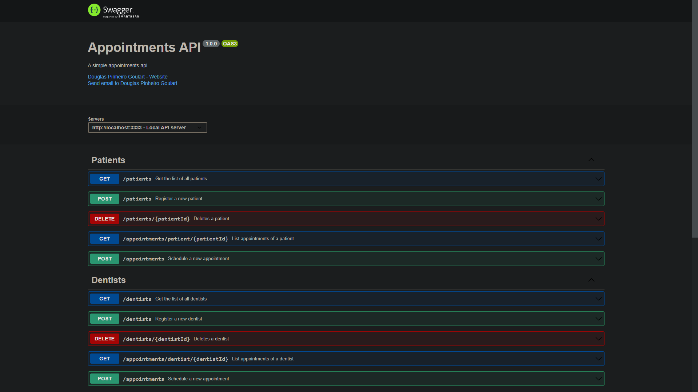

<h1 align="center">Welcome to Appointful 👋</h1>
<p>
  
  <a href="#" target="_blank">
    
  </a>
</p>

> A simple appointments api

## Install

```sh
yarn install
```

## Usage

```sh
yarn dev
```

## Run tests

```sh
yarn test
```

## Docs

You can access the documentation by using the `/docs` endpoint.

`http://localhost:3333/docs`



## TO-DO

- [x] Allow to cancel an appointment
- [x] Allow to schedule an appointment
- [x] Rename create appointment use case to schedule appointment
- [x] Create email value object with email validation
- [x] Throw overlapping dates error only when trying to schedule an appointment with the same dentist
- [x] Add husky and lint-staged to check if everything is fine before commiting
- [x] List patient's appointments
- [x] Allow to list appointments from a specific dentist
- [x] Create payload data validation
- [x] Create http routes

## Author

👤 **Douglas Pinheiro Goulart**

* Website: https://www.douglasgoulart.com/
* Github: [@doougui](https://github.com/doougui)
* LinkedIn: [@douglaspigoulart](https://linkedin.com/in/douglaspigoulart)

## 🤝 Contributing

Contributions, issues and feature requests are welcome!<br />Feel free to check [issues page](https://github.com/doougui/appointful/issues).

## Show your support

Give a ⭐️ if this project helped you!
